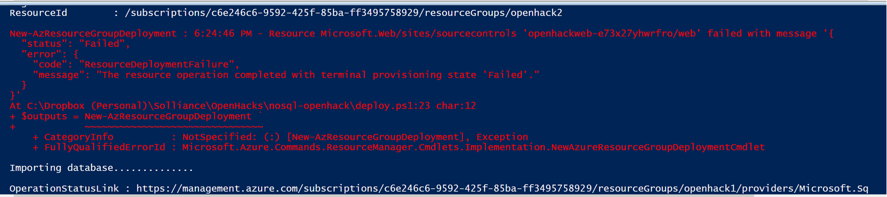
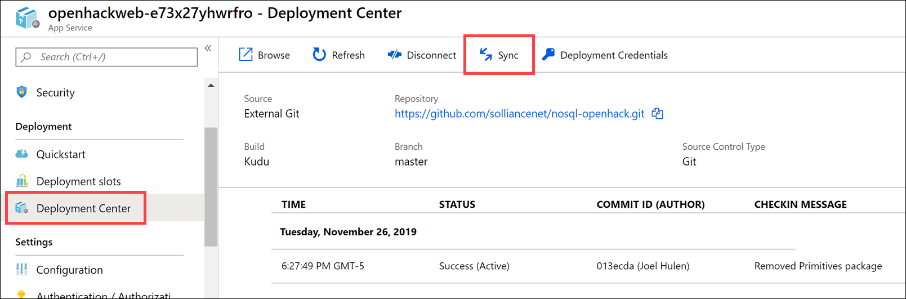

# Microsoft NoSQL OpenHack deployment instructions

These instructions are for coaches to deploy Azure resources for the OpenHack classroom environment.

## PowerShell instructions

1. Open a **PowerShell ISE** window, run the following command, if prompted, click **Yes to All**:

   ```PowerShell
   Set-ExecutionPolicy -Scope Process -ExecutionPolicy Bypass
   ```

2. Make sure you have the latest PowerShell Azure module installed by executing the following command:

    ```PowerShell
    Install-Module -Name Az -AllowClobber -Scope CurrentUser
    ```

3. If you installed an update, **close** the PowerShell ISE window, then **re-open** it. This ensures that the latest version of the Az module is used.

4. Execute the following to sign in to the Azure account:

    ```PowerShell
    Connect-AzAccount
    ```

5. Open the `deploy.ps1` PowerShell script in the PowerShell ISE window and update the following variables:

    > **Note**: The hosted Azure subscriptions do not support deploying SQL Server to all locations. You can use the Create Resource form in the portal while signed in as a class user, select SQL Database, select new SQL Server, then select locations in the dropdown list until you've identified the ones that don't cause a "this location is not supported" alert.

    ```PowerShell
    # Enter the first Resource Group name (i.e. openhack1)
    $resourceGroup1Name = "openhack1"
    # Enter the second Resource Group name (i.e. openhack2)
    $resourceGroup2Name = "openhack2"
    # Enter the location for the first resource group (i.e. westus2)
    $location1 = "westus2"
    # Enter the location for the second resource group (i.e. eastus)
    $location2 = "eastus"
    # Enter the SQL Server username (i.e. openhackadmin)
    $sqlAdministratorLogin = "openhackadmin"
    # Enter the SQL Server password (i.e. Password123)
    $sqlAdministratorLoginPassword = "Password123"
    ```

6. Press **F5** to run the script, this will do the following:

   - Deploy the ARM template
   - Restore the Azure SQL database from a `.bacpac` file
   - Deploy the sample web app

7. If you receive an error during the ARM template deployment for `Resource Microsoft.Web/sites/sourcecontrols`, with an error code of `ResourceDeploymentFailure` and message stating `The resource operation completed with terminal provisioning state 'Failed'.`, this means the automated web app deployment from GitHub failed. This is most likely due to a timeout during the NuGet package restore process.

    

    If you see this message, perform the following steps:

    1. Log in to the Azure portal (<https://portal.azure.com>) with the account used for your deployment.
    2. Open the `resourceGroup1Name` resource group (default is "openhack1").
    3. Open the App Service whose name starts with "openhackweb-".
    4. Select **Deployment Center** in the left-hand menu. Most likely, the deployment status will display as "Failed". Select **Sync** to initiate a new build from the connected GitHub repo. If the status shows as Failed again, select the Logs link to view the latest logs.

    

## Deployment artifacts

After deployment has completed, you should see the following resources:

- Resource group 1 ("openhack1")

  - Event Hubs Namespace with an event hub named `telemetry`
  - SQL Server with firewall settings set to allow all Azure services and IP addresses from 0.0.0.0 - 255.255.255.255
  - Azure SQL Database named `Movies`
  - App Service containing the deployed web app with a SQL connection string added to the Configuration settings

- Resource group 2 ("openhack2")

  - Event Hubs Namespace with an event hub named `telemetry`

> [Download the zip file](https://databricksdemostore.blob.core.windows.net/data/nosql-openhack/DataGenerator.zip) for the data generator used in the OpenHack.
